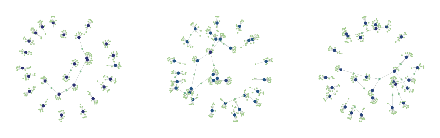

# Temporal Networks and the Activity Driven Framework

Short introduction to temporal networks, the activity driven framework, and epidemic processes on activity driven networks

---
1. Notebook [01_activity_driven_networks.ipynb](https://github.com/ngozzi/temporal-networks/blob/main/code/01_activity_driven_networks.ipynb) contains code to:
- Sample activities from a fiven distribution
- Generate temporal networks using the activity driven framework as generating method
- Display the simulated temporal networks

### References
- Holme, P., & Saramäki, J. (2012). Temporal networks. Physics reports, 519(3), 97-125.
- Masuda, N., & Lambiotte, R. (2016). A guide to temporal networks.
- Holme, P., & Saramäki, J. (Eds.). (2019). Temporal network theory (Vol. 2). New York: Springer.
- [Sociopatterns](http://www.sociopatterns.org/)
- Perra, N., Gonçalves, B., Pastor-Satorras, R., & Vespignani, A. (2012). Activity driven modeling of time varying networks. Scientific reports, 2(1), 469.
- Liu, S., Perra, N., Karsai, M., & Vespignani, A. (2014). Controlling contagion processes in activity driven networks. Physical review letters, 112(11), 118702.
